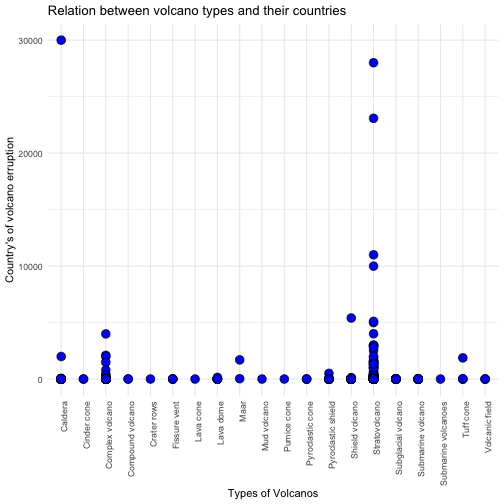
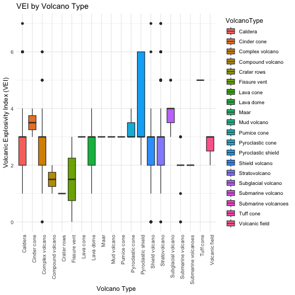
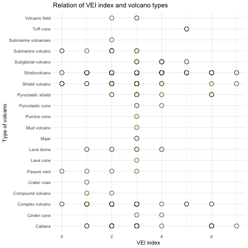
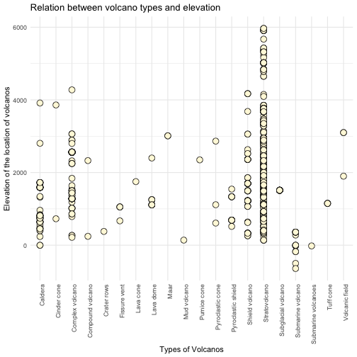
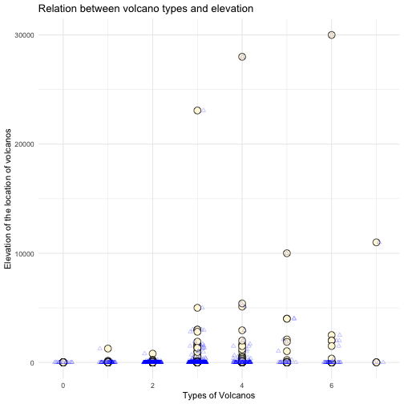
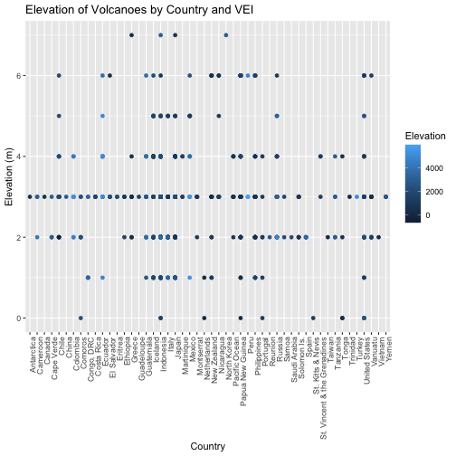
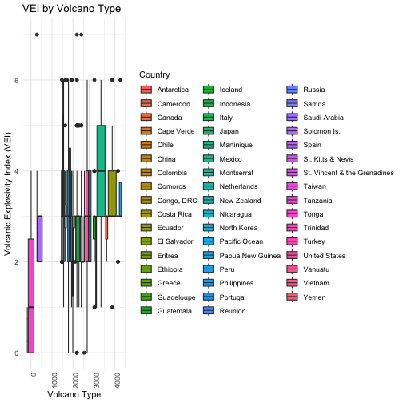

``` r
library(dplyr)
```


``` r
library(tidyverse)
```


``` r
#load dataset and  Removing # comments
# as the csv file is seperated with semicolon (;)

datavolcano <-  read.csv("significant-volcanic-eruption-database.csv",header = FALSE, sep = ";" ,comment.char = "#")
view(datavolcano)

#to add row nuumbers in dataset
datavolcano$RowNumber <- seq_len(nrow(datavolcano)) 
```


``` r
save_path <- "/Users/vivekkumar/Documents/r/aitproject/updated_volanno.csv"  

write.csv(datavolcano,"/Users/vivekkumar/Documents/r/aitproject/updated_volanno.csv", row.names = FALSE)
```


``` r
read.csv("updated_volanno.csv")
```


``` r
median_vei <- median(updated_volanno$VolcanicExplosivityIndex, na.rm = TRUE)

updated_volanno[is.na(updated_volanno$VolcanicExplosivityIndex),"Volcanic Explosivity Index"] <- median_vei

median_deaths <- median(updated_volanno$Volcanicdeaths, na.rm = TRUE)

updated_volanno[is.na(updated_volanno$Volcanicdeaths),"Volcanicdeaths"] <- median_deaths
```


``` r
names(updated_volanno) [10] <- "VolcanoType"
names(updated_volanno) [12] <- "VolcanicExplosivityIndex"
names(updated_volanno) [13] <- "Volcanicdeaths"
```


``` r
head(updated_volanno)
```
This is the analysis between volcano types and volcano deaths 

``` r
ggplot(updated_volanno,aes(x=VolcanoType,y=Volcanicdeaths)) +
  geom_point(shape =21 ,fill ="blue",size =3.7,colour ="black")+
  labs(x="Types of Volcanos",
       y="Country's of volcano erruption",
       title="Relation between volcano types and their countries") +
  theme_minimal()+
    theme(axis.text.x = element_text(angle = 90, hjust = 1))
```


#By this visualization, its correation with type of volcano and deaths happened by that volcano. Many of the #volcanos occued are stratovolcano and most deaths also caused it it. And caldera type occured very rarely but it #has most no of deaths. Complex volcano also occured many time but, there is no loss in lifes


#Relation of volcano type and VEI

``` r
ggplot(updated_volanno, aes(x = VolcanoType, y = VolcanicExplosivityIndex, fill = VolcanoType)) +
  geom_boxplot() +
  labs(title = "VEI by Volcano Type", x = "Volcano Type", y = "Volcanic Explosivity Index (VEI)") +
  theme_minimal()+
  theme(axis.text.x = element_text(angle = 90, hjust = 1))
```



#to visualize the relation between Volcano type and VEI a box plot can also be used. 
#This allow us to compare the VEI across different types of volcanos


``` r
ggplot(updated_volanno,aes(x=VolcanicExplosivityIndex,y=VolcanoType)) +
  geom_point(shape =21 ,fill ="cornsilk",size =3.7,colour ="black")+
  labs(x="VEI index ",
       y="Type of volcano ",
       title="Relation of VEI index and volcano types") +
  theme_minimal()
```



#Relation of volcano type and elevation 

``` r
ggplot(updated_volanno,aes(x=VolcanoType,y=Elevation)) +
  geom_point(shape =21 ,fill ="cornsilk",size =3.7,colour ="black")+
  labs(x="Types of Volcanos",
       y="Elevation of the location of volcanos",
       title="Relation between volcano types and elevation")+
  theme_minimal()+
  theme(axis.text.x = element_text(angle = 90, hjust = 1))
```



#the Relation between elevation and volcano type is curcial because it's used to understand the length of magma 
#errupted and helps in VEI and impact of created. Such as if the elevation is high then it shoulg be mountain 
#we can get the environment insights, geological impact


#Relation of VEI and Volcano deaths 


``` r
ggplot(updated_volanno, aes(x=VolcanicExplosivityIndex, y=Volcanicdeaths)) + 
  geom_point(shape =21 ,fill ="cornsilk",size =3.7,colour ="black")+
   geom_jitter(alpha = 0.3,width = 0.2,height = 0.2,shape=2,color = "blue")+
  labs(x="Types of Volcanos",
       y="Elevation of the location of volcanos",
       title="Relation between volcano types and elevation")+
  theme_minimal()
```


#The relation of VEI and Deaths using scatter plot all the point are close to each other so we used #jitter which shakes points little so that we can see the patter. According to it On VEI scale most
#of the Volcanos caused deaths are above 3 . Volcanos below 3 causeing death is very rare


``` r
ggplot(updated_volanno, aes(x = Country, y =VolcanicExplosivityIndex, color = Elevation))+
  geom_point( ) +
  labs(title = "Elevation of Volcanoes by Country and VEI",
       x = "Country", y = "Elevation (m)", color= "Elevation") +
  theme(axis.text.x = element_text(angle = 90, hjust = 1))
```




``` r
ggplot(updated_volanno, aes(x = Elevation, y =VolcanicExplosivityIndex, fill = Country)) +
  geom_boxplot() +
  labs(title = "VEI by Volcano Type", x = "Volcano Type", y = "Volcanic Explosivity Index (VEI)") +
  theme_minimal()+
  theme(axis.text.x = element_text(angle = 90, hjust = 1))
```



``` r
library(knitr)
knit("AutomationPricingReport.Rmd", "AutomationPricingReport.docx")
```

```
## Warning in file(con, "r"): cannot open file 'AutomationPricingReport.Rmd': No such file or
## directory
```

```
## Error in file(con, "r"): cannot open the connection
```


